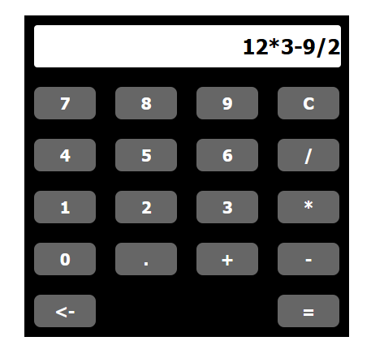

# Calculator React App

This project was developed as an assignment for CES-26 course of Instituto Tecnológico de Aeronáutica. 
It is a React App for a calculator that uses Redux to deal with its states. 
Besides the four basic arithmetic operations, this calculator also supports floating point operations and contains clear and backspace buttons.

## Project Structure
    ├── public                    # static files
    ├── src                       # dynamic files
      ├── redux                   # redux files to deal with calculator states
        ├── actions.js
        ├── reducers.js
        ├── store.js
        ├── types.js
     ├── App.css                  # styles for calculator interface
     ├── App.js                   # implements calculator interface
     ├── index.js                 # integrates react and redux
   
## Redux actions implemented

- `SET_EXPRESSION`: adds entries to the arithmetic expression.
- `EVALUATE_EXPRESSION`: calculates the result of the arithmetic expression.
- `DELETE_LAST_ENTRY`: deletes the last entry of the arithmetic expression.
- `CLEAR_EXPRESSION`: clears the arithmetic expression.

The implementation of these actions deals with some possible errors of usage by the user.

## Running the project

### `npm start`

Runs the app in the development mode.\
Open [http://localhost:3000](http://localhost:3000) to view it in the browser.

The page will reload if you make edits.\
You will also see any lint errors in the console.
